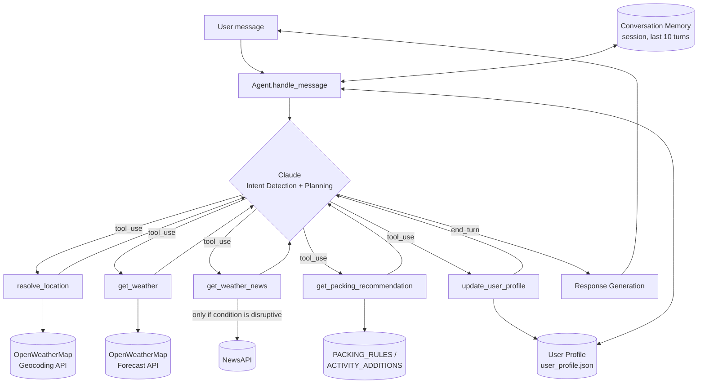

# Weather & Commute Assistant

An LLM tool-calling agent that helps you prepare for your day - commuting,
travel, or outdoor activities - by checking the weather, relevant travel
news, and recommending what to pack.

## How it works

The agent uses Claude (via the Anthropic SDK) with tool-calling to:

1. Interpret the request (location, date(s), activity type)
2. Resolve the location (handling ambiguous city names like "Springfield")
3. Check the weather forecast (`get_weather`, OpenWeatherMap)
4. Conditionally check travel news if conditions look disruptive
   (`get_weather_news`, NewsAPI)
5. Recommend what to pack (`get_packing_recommendation`)
6. Remember persistent preferences (home/work location, units) across
   sessions in `user_profile.json`

## Architecture



The agent loop (`WeatherCommuteAgent.handle_message`) repeatedly calls Claude
with the conversation so far, the user profile context, and the tool
schemas. Each round, Claude either calls one or more tools (executed
locally, with results fed back as `tool_result` messages) or produces a
final text response. A `MAX_TOOL_ITERATIONS` cap and a top-level
`anthropic.APIError` handler guard against runaway loops and API outages.

## Failure Handling

### 1. Weather service unavailable

If OpenWeatherMap is unreachable, returns an error status, or the API key is
missing/invalid, `tools/weather.py` catches the failure and returns
`{"error": "..."}` instead of raising. The system prompt (step 9) instructs
the agent to explain the limitation to the user and give general
seasonal/packing advice instead of failing silently.

**To test:** temporarily comment out `OPENWEATHER_API_KEY` in `.env`,
restart the app, and ask *"What should I wear in Seattle tomorrow?"* - the
agent will explain that the weather service is unavailable and still offer
general advice.

### 2. Conflicting travel advisories

"Conflicting information" can mean a few different things, and the agent
handles each differently rather than treating all news as equally reliable:

- **Multiple recent headlines disagree with each other** (e.g. one says a
  highway is closed, another says it reopened, both from the last day or
  two). The agent doesn't silently pick one - it tells the user reports are
  mixed and suggests double-checking before relying on it.
- **News conflicts with the live forecast** (e.g. the forecast looks clear,
  but a headline reports storm-related flight delays). The forecast is
  authoritative for what the weather itself will be, but operational
  disruptions (delays, closures, cancellations) can persist after the weather
  clears - so the agent doesn't dismiss the headline just because the sky has
  cleared up. It's framed as e.g. "the forecast looks clear, but there may
  still be lingering delays from earlier storms."
- **Stale news that no longer applies** (e.g. a headline about a storm from a
  week ago, for a trip starting tomorrow). `tools/news.py` annotates each
  headline with `days_ago` (computed from its `publishedAt` timestamp), and
  the system prompt (step 7) instructs the agent to omit headlines with a
  large `days_ago` that aren't clearly about the trip's dates, or mention them
  only as brief background.

In short, the priority order is: **live forecast first** (for current/future
conditions), then **recent news** (for operational disruptions the forecast
won't capture), with **stale or mutually contradictory news** flagged or
downweighted rather than presented as fact.

**To test:** this is hard to trigger deterministically since it depends on
live NewsAPI results, but asking about travel to a location currently in the
news for storm-related disruptions (with a recent and an older article) will
exercise this path.

### 3. Vague or ambiguous user request

This covers three distinct cases:

- **Missing information** - e.g. *"What should I wear?"* (no location or
  date). The agent asks a clarifying question, or falls back to the saved
  `home_location` if one exists and says so explicitly (so the user can
  correct it).
- **Ambiguous location being saved as a default** - e.g. *"I live in
  Springfield"*. Before calling `update_user_profile`, the agent calls
  `resolve_location`, which hard-blocks on ambiguous names (5 US cities
  named Springfield) and asks the user to clarify, since a wrong save would
  silently affect every future request.
- **Ambiguous location for a one-off request** - e.g. *"I'm traveling to San
  Diego for two days starting tomorrow."* `get_weather` proceeds with the
  most likely match (San Diego, CA) and includes a `possible_alternates`
  list (San Diego, TX); the agent mentions the assumption inline rather than
  blocking, since the cost of a wrong guess here is low and immediately
  visible.

**To test:** try each of the three example prompts above.

## Setup

1. Create a virtual environment and install dependencies:

   ```bash
   python3 -m venv venv
   ./venv/bin/pip install -r requirements.txt
   ```

2. Copy `.env.example` to `.env` and fill in your API keys:

   ```bash
   cp .env.example .env
   ```

   - `ANTHROPIC_API_KEY` - from [console.anthropic.com](https://console.anthropic.com)
   - `OPENWEATHER_API_KEY` - from [openweathermap.org/api](https://openweathermap.org/api) (free tier; new keys can take ~2 hours to activate)
   - `NEWSAPI_API_KEY` - from [newsapi.org](https://newsapi.org)

## Running it

**CLI:**

```bash
./venv/bin/python main.py
```

**Streamlit demo UI** (shows the agent's reasoning and tool calls/results
in an expandable trace for each response):

```bash
./venv/bin/streamlit run app.py
```

## Notes

- `user_profile.json` stores persistent user info (home location, units
  preference) and is created/updated automatically - delete it to start
  fresh with a new profile.
- Conversation memory is session-scoped (in-memory, last 10 turns) and
  resets each time the process restarts.
